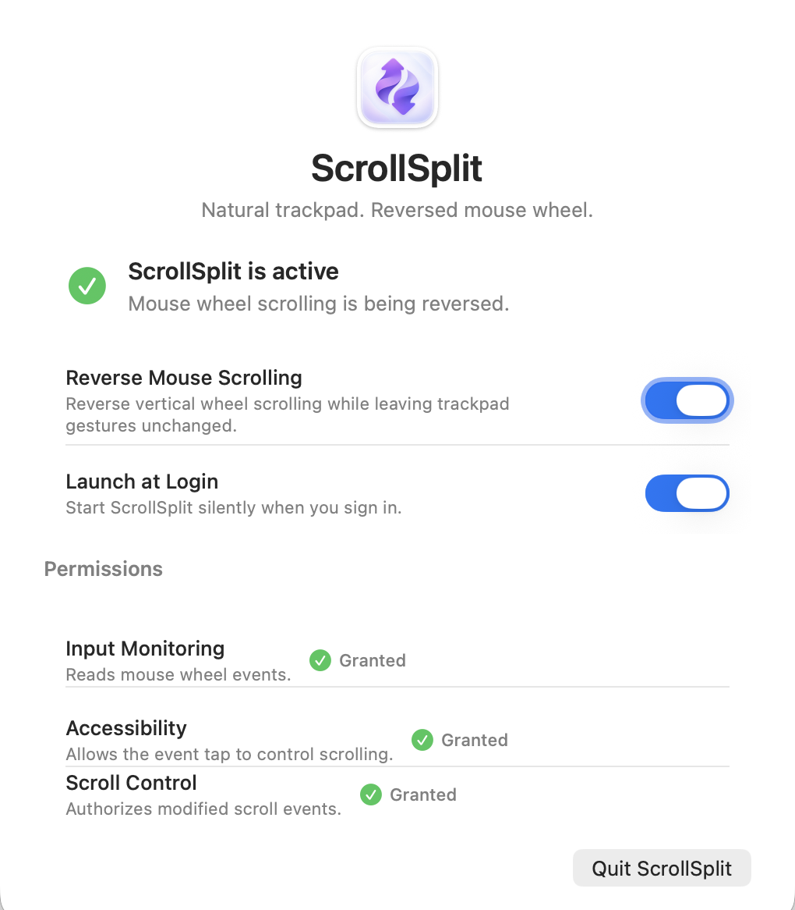

# ScrollSplit

A lightweight macOS utility that keeps Natural Scrolling on the built-in trackpad while independently reversing vertical scroll direction for an external mouse.

<div align="center">
  
</div>

---

## Download

> **Normal users: download the application from GitHub Releases — not from the "Code → Download ZIP" button.**

| | |
|---|---|
| **Latest release** | [github.com/sksonip/ScrollSplit/releases/latest](https://github.com/sksonip/ScrollSplit/releases/latest) |
| **Direct DMG download** | [ScrollSplit.dmg](https://github.com/sksonip/ScrollSplit/releases/latest/download/ScrollSplit.dmg) |

---

## What ScrollSplit Does

macOS applies a single scrolling-direction preference to all pointing devices. If you enable Natural Scrolling for your trackpad, your external mouse wheel also scrolls in the Natural direction — which many people find counterintuitive.

ScrollSplit intercepts scroll events at the session level and reverses vertical scroll direction only for events that are unambiguously from a physical mouse wheel:

- **MacBook trackpad** — keeps Natural Scrolling exactly as configured in System Settings
- **External mouse vertical wheel** — direction reversed independently
- **Horizontal scrolling** — left unchanged on all devices
- **Trackpad momentum and gestures** — never modified
- **Command + mouse wheel** — zooms in when scrolling up and zooms out when scrolling down in apps that support the standard macOS zoom shortcuts

ScrollSplit runs as a lightweight background utility with no Dock icon and no menu-bar icon. Configure it once and leave it running.

> **Note:** Continuous scroll events without a gesture phase cannot be reliably attributed to a specific device using public macOS APIs. To avoid ever accidentally reversing the trackpad, ScrollSplit leaves ambiguous continuous events unchanged. Some smooth-scrolling mouse software may therefore remain unaffected by design.

---

## Installation

1. Download **ScrollSplit.dmg** from [Releases](https://github.com/sksonip/ScrollSplit/releases/latest).
2. Open the DMG and drag **ScrollSplit** to your **Applications** folder.
3. Eject the DMG.
4. Open **ScrollSplit** from your Applications folder.

### macOS security warning — what to expect and what to do

ScrollSplit v1.3.0 is distributed outside the Mac App Store and is **not Developer ID notarized**. Because of this, macOS Gatekeeper will block the app the first time you open it. **This is expected behaviour — it does not mean macOS has detected malware.**

When you try to open ScrollSplit, you will see a dialog similar to:

> *"ScrollSplit.app" Not Opened — Apple could not verify "ScrollSplit.app" is free of malware that may harm your Mac or compromise your privacy.*

The dialog has two buttons: **Done** and **Move to Bin**.

**Follow these steps to approve the app:**

1. Click **Done** — do **not** click "Move to Bin".
2. Open **System Settings** (Apple menu → System Settings).
3. Go to **Privacy & Security**.
4. Scroll down to the **Security** section. You will see a message that says ScrollSplit was blocked because it is not from an identified developer.
5. Click **Open Anyway** next to that message.
6. Authenticate with **Touch ID** or your **Mac password** if prompted.
7. In the confirmation dialog that appears, click **Open**.
8. ScrollSplit will launch and show its settings window.

You only need to complete this process once. After approving, ScrollSplit opens normally from Applications.

> ⚠️ Do **not** disable Gatekeeper globally and do **not** use Terminal commands to bypass macOS security. The steps above are the safe, Apple-supported way to open apps that are not distributed through the Mac App Store or notarized.

5. Complete the permission setup that appears on first launch (see [Permissions](#permissions)).
6. Optionally enable **Launch at Login**.
7. Close the settings window — ScrollSplit continues running in the background.

---

## Permissions

ScrollSplit requires three permissions to intercept and modify scroll events. All are requested through standard macOS dialogs:

| Permission | Why it is needed |
|---|---|
| **Input Monitoring** | Required to receive scroll-wheel events from an external mouse at the session level. |
| **Accessibility** | Required for the Core Graphics event tap to be authorised by macOS. |
| **Scroll Control** (Post Event) | Required to modify and re-post scroll events back to the system. |

ScrollSplit will guide you to the correct pane in **Privacy & Security** if any permission is missing. After granting a permission, quit and reopen ScrollSplit once, then enable **Reverse Mouse Scrolling** again.

---

## Usage

When you open ScrollSplit, the settings window shows the current state:

- **Reverse Mouse Scrolling** — main on/off toggle. Enabling it activates the scroll intercept immediately if all permissions are granted.
- **Launch at Login** — registers ScrollSplit as a login item so it starts automatically on every login. macOS may ask for confirmation the first time.
- **Software Updates** — securely checks GitHub for a new release every 30 days. Use **Check for Updates…** to check immediately. Updates are installed only after you approve them.
- **Closing the window does not quit ScrollSplit.** The scrolling service continues running in the background.
- To reopen the settings window, launch ScrollSplit again from Applications (or the Dock/Finder).
- **Quit ScrollSplit** fully stops the application and the scrolling service.

---

## Privacy

Verified by source-code audit:

- **No telemetry** — ScrollSplit does not report usage or events to any service.
- **No analytics** — no analytics framework or endpoint is present.
- **Update checks only** — ScrollSplit contacts the GitHub-hosted Sparkle feed every 30 days, or when you click **Check for Updates…**. No usage information or scroll data is sent.
- **No data collection** — scroll activity, timing, and device information are processed locally and immediately discarded. Nothing is stored beyond the on/off preference in your local `UserDefaults`.

---

## Requirements

| | |
|---|---|
| **macOS** | 13.0 Ventura or later |
| **Architecture** | Apple Silicon (arm64) |
| **Xcode / Command Line Tools** | Not required to run the app |

> Normal users installing `ScrollSplit.dmg` do **not** need Xcode or any developer tools.

---

## Building from Source

Building from source requires Xcode 15 or later (or the matching Command Line Tools) and macOS 13+.

```sh
# Build a release app bundle → dist/ScrollSplit.app
make app

# Build a debug app bundle
make build

# Build the release app and DMG
make dmg

# Run smoke tests (no macOS daemon or permissions required)
make test

# Remove build artifacts
make clean
```

The first build downloads the pinned Sparkle dependency. The build script (`scripts/build-app.sh`) embeds `Sparkle.framework`, uses Developer ID when available for release builds, and otherwise falls back to ad-hoc signing. Debug builds may use an Apple Development identity. Set `REQUIRE_STABLE_SIGNING=1` to fail instead, or `CODESIGN_IDENTITY` to select a specific identity.

The built app bundle is written to `dist/ScrollSplit.app`. Copy it to `/Applications`, open it, and grant the required permissions as described under [Installation](#installation).

---

## Technical Overview

- **Language:** Swift
- **UI framework:** AppKit (programmatic, no XIB/storyboard)
- **Event interception:** Core Graphics session-level event tap (`CGEvent.tapCreate` at `.cgSessionEventTap`)
- **Scroll classification:** Stateless classifier using phase, continuity, and delta fields on each `CGEvent`
- **Preferences:** `UserDefaults` (local, no iCloud sync)
- **Launch at Login:** `SMAppService.mainApp`
- **Software updates:** Sparkle 2 with EdDSA-signed archives hosted in GitHub Releases

---

## Publishing a Release

Updates are published by `.github/workflows/release.yml`. The workflow runs only for a three-part version tag such as `v1.3.0`, verifies that the tag matches `Info.plist`, builds the app and DMG, signs the Sparkle ZIP, generates `appcast.xml`, and publishes all three files to GitHub Releases.

Before publishing the first update, add the Sparkle private key to the repository once:

```sh
# Build once so the Sparkle tools are available.
make app

# Export the project key that matches SUPublicEDKey in Info.plist.
.build/app/artifacts/sparkle/Sparkle/bin/generate_keys \
  --account com.satishkumarsoni.ScrollSplit \
  -x .sparkle-private-key

# Store it as an encrypted GitHub Actions repository secret.
gh secret set SPARKLE_PRIVATE_KEY < .sparkle-private-key
```

Delete `.sparkle-private-key` after the secret is stored. The filename is ignored by Git and the private key must never be committed. Then publish by updating both bundle versions, committing the change, and pushing the matching tag:

```sh
git tag v1.3.0
git push origin v1.3.0
```

The GitHub Release ZIP is used for in-app updates. `ScrollSplit.dmg` remains the download for new installations. Versions older than 1.3.0 require one final manual installation before they can update themselves.

---

## License

ScrollSplit is available under the [MIT License](LICENSE).
